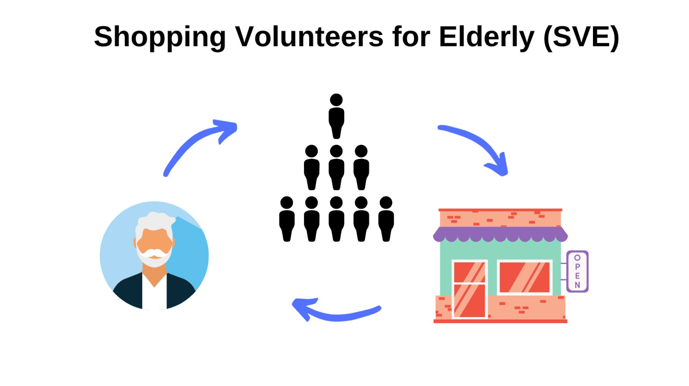
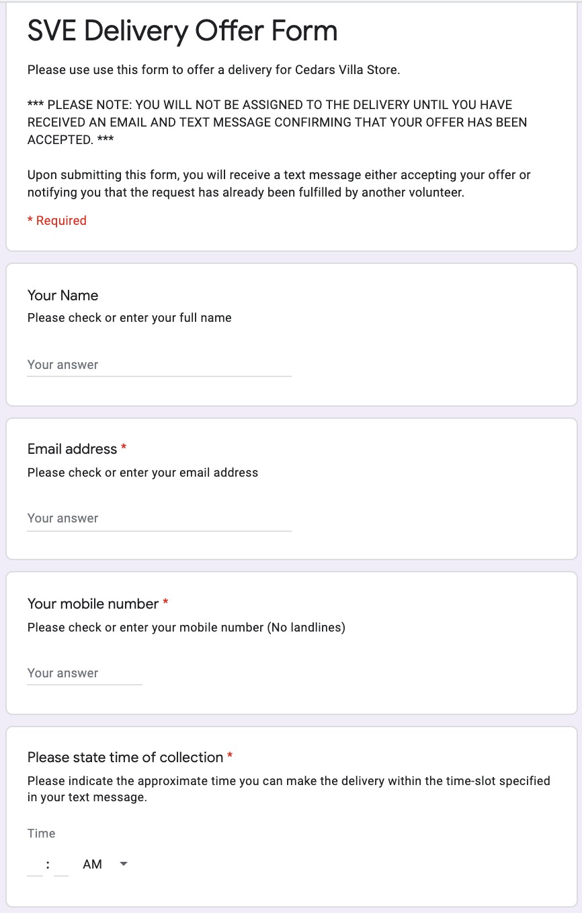
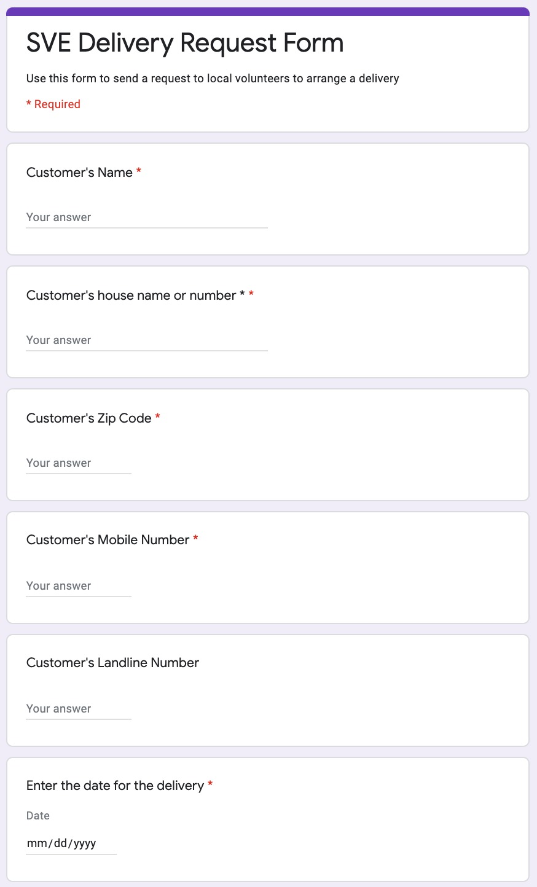
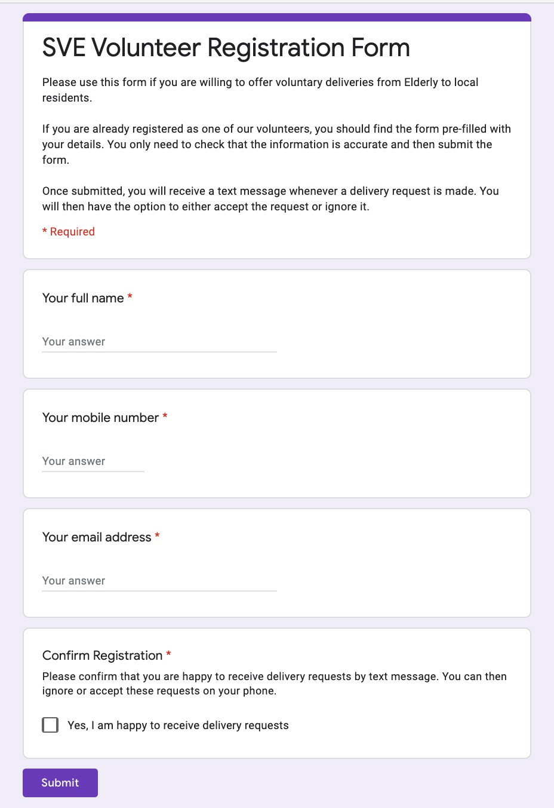
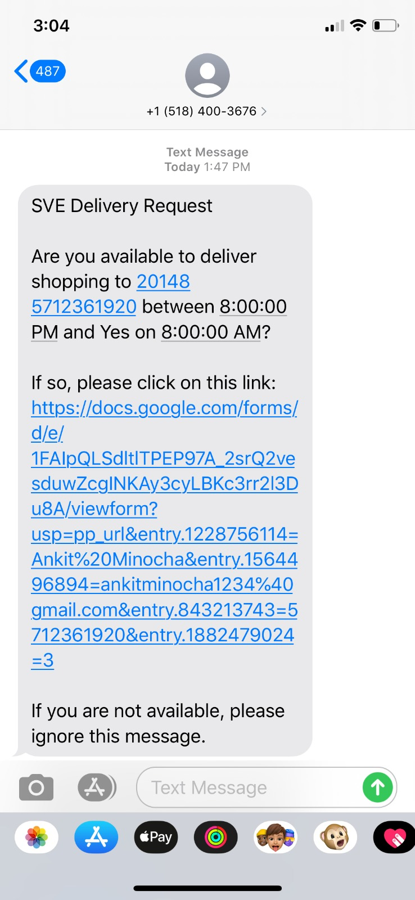

 

There are three google scripts to each of the forms.
Form types:
1. Request form: This is here elderly will make a request.
2. Volunteer form: This is used to store the volunteer information
3. Volunteer to Elderly match form: This is used by volunteer to accept the offer.

Steps to setup scripts:
These three scripts present in this repo are related to each of the forms.  Follow the following steps for each of them.

1. Tools -> Script Editor
2. Google script will open. 
3. Edit -> Current Project's trigger
4. Click on Add trigger in bottom right corner
5. Select the ffollowing options:
   - Choose which function to run : onSheetUpdate
   - Which runs at deployment : Head
   - Select event source : From spreadsheet
   - Select event type : On form submit

 Please update the link of the document and sheet name in the top of each of the scripts.
 Also, the account sid, auth token and messaging sid needs to be updated.

 

 

 

 

 